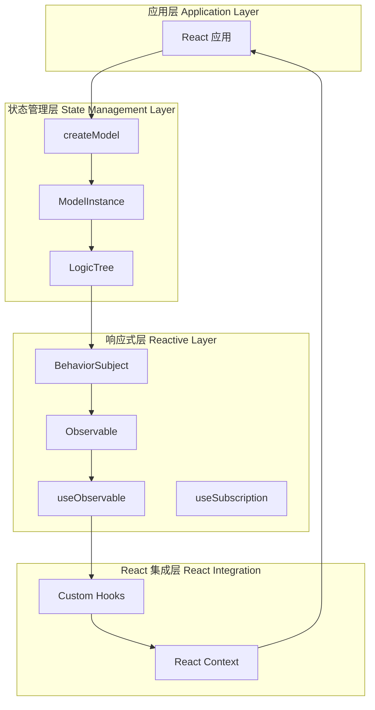
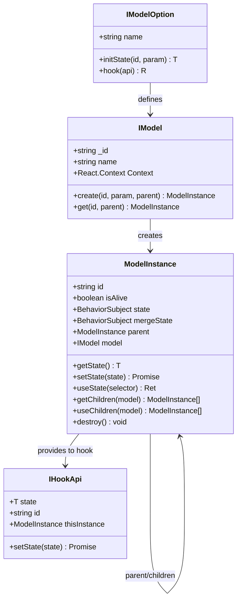
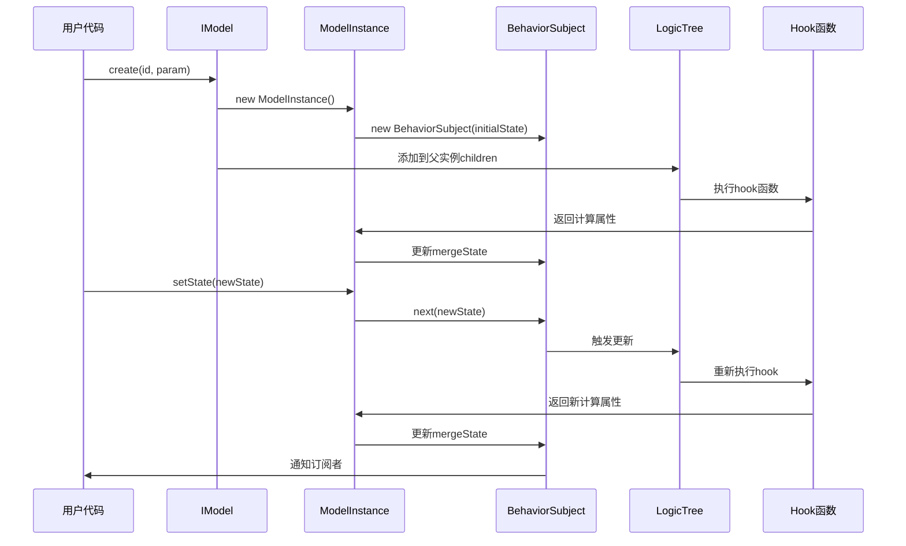
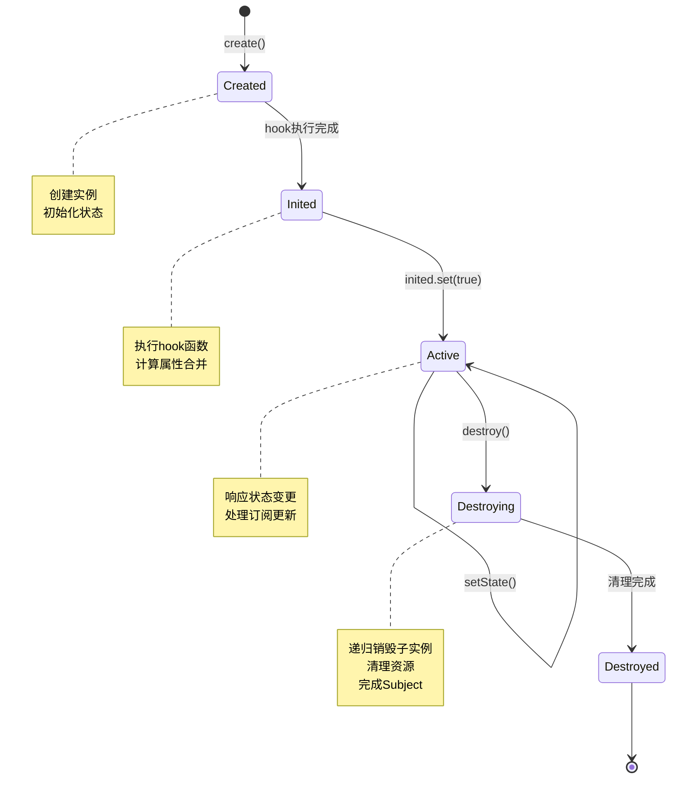
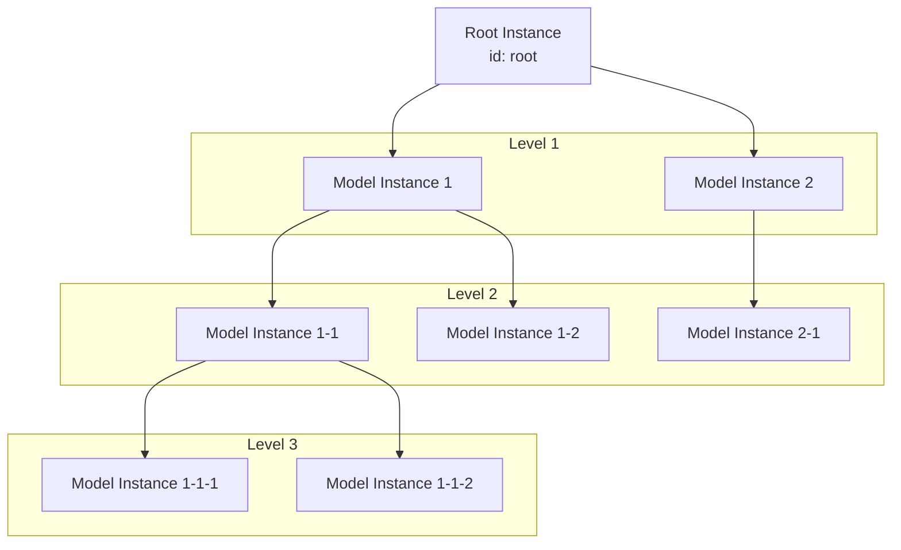

# RState - 响应式状态管理库

基于 React、RxJS 和 observable-hooks 的响应式状态管理解决方案。

## 核心特性

- 基于类的模型实例实现
- 响应式状态管理
- 模型实例的层级管理
- 计算属性支持
- 状态持久化和变更通知
- 异步初始化支持

## 架构设计

### 整体架构图



### 核心概念关系图



## 核心概念

### 1. Model（模型）

模型是状态管理的核心单元，定义了状态的结构和行为。

```typescript
interface IModel<T, P, R> {
  _id: string;              // 模型唯一标识符
  name?: string;            // 模型名称
  create(id, param, parent); // 创建实例
  get(id, parent);          // 获取实例
  Context;                  // React Context
}
```

### 2. ModelInstance（模型实例）

模型实例是模型的具体实现，管理实际的状态数据。

```typescript
class ModelInstance<T, R> {
  id: string;                    // 实例ID
  isAlive: boolean;              // 存活状态
  state: BehaviorSubject<T>;     // 状态流
  mergeState: BehaviorSubject<T & R>; // 合并状态流
  parent?: ModelInstance;        // 父实例
  model?: IModel;                // 所属模型
}
```

### 3. Hook（计算属性钩子）

用于定义派生状态和副作用逻辑。

```typescript
interface IHookApi<T> {
  state: T;                      // 当前状态
  setState: (state) => Promise;  // 状态更新方法
  id: string;                    // 实例ID
  thisInstance: ModelInstance;   // 实例引用
}
```

## 状态流转流程



## 实例生命周期



## 层级结构管理



## API 文档

### createModel

创建一个模型定义。

```typescript
function createModel<T, P, R>(option: IModelOption<T, P, R>): IModel<T, P, R>
```

**参数：**
- `option.name` - 模型名称（可选）
- `option.initState` - 初始化状态函数
- `option.hook` - 计算属性钩子函数（可选）

**返回：**
- `IModel` - 模型定义对象

**示例：**

```typescript
const counterModel = createModel({
  name: 'Counter',
  initState: (id, param) => ({
    count: param.initialCount || 0,
    step: 1,
  }),
  hook: ({ state, setState }) => ({
    doubleCount: state.count * 2,
    increment: () => setState({ count: state.count + state.step }),
    decrement: () => setState({ count: state.count - state.step }),
  }),
});
```

### Model.create

创建模型实例。

```typescript
model.create(id: string, param: P, parent?: ModelInstance): ModelInstance<T, R>
```

**参数：**
- `id` - 实例唯一标识符
- `param` - 初始化参数
- `parent` - 父实例（可选，默认为根实例）

**返回：**
- `ModelInstance` - 模型实例

**示例：**

```typescript
const counter = counterModel.create('counter-1', { initialCount: 10 });
```

### Model.get

获取已存在的模型实例。

```typescript
model.get(id: string, parent?: ModelInstance): ModelInstance<T, R> | undefined
```

**参数：**
- `id` - 实例唯一标识符
- `parent` - 父实例（可选）

**返回：**
- `ModelInstance | undefined` - 模型实例或 undefined

**示例：**

```typescript
const existingCounter = counterModel.get('counter-1');
```

### instance.useState

响应式订阅实例状态。

```typescript
instance.useState<Ret>(selector?: (state: T & R) => Ret): Ret
```

**参数：**
- `selector` - 状态选择器函数（可选）

**返回：**
- `Ret` - 选择后的状态值

**示例：**

```typescript
function CounterComponent() {
  const counter = counterModel.get('counter-1');
  const count = counter.useState(state => state.count);
  const doubleCount = counter.useState(state => state.doubleCount);
  
  return (
    <div>
      <p>Count: {count}</p>
      <p>Double: {doubleCount}</p>
    </div>
  );
}
```

### instance.setState

更新实例状态。

```typescript
instance.setState(state: Partial<T> | ((prevState: T) => Partial<T>)): Promise<void>
```

**参数：**
- `state` - 部分状态对象或状态更新函数

**返回：**
- `Promise<void>` - 状态更新完成的 Promise

**示例：**

```typescript
// 对象式更新
await counter.setState({ count: 20 });

// 函数式更新
await counter.setState(prev => ({ count: prev.count + 1 }));
```

### instance.getState

获取当前状态（非响应式）。

```typescript
instance.getState(): T
```

**返回：**
- `T` - 当前状态值

**示例：**

```typescript
const currentState = counter.getState();
console.log(currentState.count);
```

### instance.destroy

销毁实例及其所有子实例。

```typescript
instance.destroy(): Promise<void>
```

**示例：**

```typescript
await counter.destroy();
```

### instance.getChildren

获取指定模型的子实例列表。

```typescript
instance.getChildren<T1, P1, R1>(model: IModel<T1, P1, R1>): ModelInstance<T1, R1>[]
```

**示例：**

```typescript
const todos = todoListModel.get('list-1');
const todoItems = todos.getChildren(todoItemModel);
```

### instance.useChildren

响应式获取子实例列表。

```typescript
instance.useChildren<T1, P1, R1>(model: IModel<T1, P1, R1>): ModelInstance<T1, R1>[]
```

**示例：**

```typescript
function TodoList() {
  const list = todoListModel.get('list-1');
  const items = list.useChildren(todoItemModel);
  
  return (
    <ul>
      {items.map(item => (
        <TodoItem key={item.id} instance={item} />
      ))}
    </ul>
  );
}
```

### createSingleton

创建单例模型实例。

```typescript
function createSingleton<T, R>(option: IModelOption<T, {}, R>): ModelInstance<T, R>
```

**示例：**

```typescript
const globalState = createSingleton({
  name: 'GlobalState',
  initState: () => ({
    theme: 'light',
    language: 'zh-CN',
  }),
  hook: ({ state, setState }) => ({
    toggleTheme: () => setState({ 
      theme: state.theme === 'light' ? 'dark' : 'light' 
    }),
  }),
});
```

### destroyAll

销毁所有模型实例。

```typescript
function destroyAll(): void
```

**示例：**

```typescript
// 应用退出时清理
destroyAll();
```

### clearAll

清除所有子实例（保留根实例）。

```typescript
function clearAll(): void
```

**示例：**

```typescript
// 重置应用状态
clearAll();
```

## 使用示例

### 基础计数器

```typescript
// 1. 定义模型
const counterModel = createModel({
  name: 'Counter',
  initState: (id) => ({ count: 0 }),
  hook: ({ state, setState }) => ({
    increment: () => setState({ count: state.count + 1 }),
    decrement: () => setState({ count: state.count - 1 }),
  }),
});

// 2. 创建实例
const counter = counterModel.create('main', {});

// 3. 在组件中使用
function CounterView() {
  const count = counter.useState(s => s.count);
  
  return (
    <div>
      <p>Count: {count}</p>
      <button onClick={() => counter.increment()}>+</button>
      <button onClick={() => counter.decrement()}>-</button>
    </div>
  );
}
```

### 待办事项列表

```typescript
// TodoItem 模型
const todoItemModel = createModel({
  name: 'TodoItem',
  initState: (id, param: { text: string }) => ({
    text: param.text,
    completed: false,
  }),
  hook: ({ state, setState }) => ({
    toggle: () => setState({ completed: !state.completed }),
  }),
});

// TodoList 模型
const todoListModel = createModel({
  name: 'TodoList',
  initState: (id) => ({ 
    filter: 'all' as 'all' | 'active' | 'completed',
  }),
  hook: ({ state, setState, thisInstance }) => ({
    addItem: (text: string) => {
      const id = Date.now().toString();
      todoItemModel.create(id, { text }, thisInstance);
    },
    removeItem: (id: string) => {
      thisInstance.removeChildren(todoItemModel, id);
    },
    setFilter: (filter: typeof state.filter) => {
      setState({ filter });
    },
  }),
});

// 使用组件
function TodoApp() {
  const list = todoListModel.create('main', {});
  const { filter } = list.useState();
  const items = list.useChildren(todoItemModel);
  
  const filteredItems = items.filter(item => {
    const { completed } = item.getState();
    if (filter === 'active') return !completed;
    if (filter === 'completed') return completed;
    return true;
  });
  
  return (
    <div>
      <button onClick={() => list.addItem('New Task')}>
        Add Task
      </button>
      <ul>
        {filteredItems.map(item => {
          const { text, completed } = item.useState();
          return (
            <li key={item.id}>
              <input 
                type="checkbox" 
                checked={completed} 
                onChange={() => item.toggle()}
              />
              {text}
              <button onClick={() => list.removeItem(item.id)}>
                Delete
              </button>
            </li>
          );
        })}
      </ul>
    </div>
  );
}
```

### 异步状态管理

```typescript
const userModel = createModel({
  name: 'User',
  initState: (id) => ({
    user: null as User | null,
    loading: false,
    error: null as Error | null,
  }),
  hook: ({ state, setState }) => ({
    fetchUser: async (userId: string) => {
      setState({ loading: true, error: null });
      try {
        const response = await fetch(`/api/users/${userId}`);
        const user = await response.json();
        setState({ user, loading: false });
      } catch (error) {
        setState({ error: error as Error, loading: false });
      }
    },
  }),
});

// 使用
function UserProfile({ userId }: { userId: string }) {
  const userInstance = userModel.create(userId, {});
  const { user, loading, error } = userInstance.useState();
  
  useEffect(() => {
    userInstance.fetchUser(userId);
  }, [userId]);
  
  if (loading) return <div>Loading...</div>;
  if (error) return <div>Error: {error.message}</div>;
  return <div>{user?.name}</div>;
}
```

## 内部实现细节

### Symbol 属性

使用 Symbol 作为内部属性键，避免外部误用：

```typescript
const STATE = Symbol("state");           // 原始状态流
const MERGE_STATE = Symbol("mergeState"); // 合并状态流
const ALIVE = Symbol("alive");           // 存活标识
const CHILDREN = Symbol("children");     // 子实例映射
const CHILDREN_CHANGE = Symbol("childrenChange"); // 子实例变更通知
const HOOK = Symbol("hook");             // 计算属性钩子
const SYNC = Symbol("sync");             // 同步通知
export const SET_STATE = Symbol("setState"); // 状态更新方法
```

### LogicTree 组件

LogicTree 是内部核心组件，负责：
1. 递归渲染模型实例树
2. 执行计算属性钩子
3. 合并状态和计算属性
4. 管理子实例的渲染

### 响应式更新机制

1. **状态变更**：`setState` → `BehaviorSubject.next()`
2. **通知订阅者**：`Observable` → `useSubscription`
3. **触发重渲染**：`useState` Hook 更新

### 性能优化

- **浅比较**：使用 `shallowEqual` 避免不必要的状态更新
- **memo**：LogicTree 使用 `memo` 优化渲染
- **skip(1)**：跳过 BehaviorSubject 的初始值
- **useMemo**：缓存计算结果

## 最佳实践

### 1. 模型设计原则

- **单一职责**：每个模型只管理一个领域的状态
- **最小状态**：只存储必要的状态，派生状态通过 hook 计算
- **明确命名**：使用有意义的模型名称和实例 ID

### 2. 状态更新

- 使用函数式更新访问前一个状态
- 批量更新合并为一个 setState 调用
- 避免在渲染过程中调用 setState

### 3. 性能优化

- 使用 selector 函数只订阅需要的状态片段
- 合理使用 useChildren 避免不必要的重渲染
- 及时销毁不再使用的实例

### 4. 类型安全

- 为模型定义明确的类型参数
- 使用 TypeScript 的类型推断
- 导出模型的类型定义供外部使用

## 技术栈

- **React 18+**：UI 框架
- **RxJS**：响应式编程库
- **observable-hooks**：React 与 RxJS 的桥梁
- **TypeScript**：类型系统
- **lodash-es**：工具函数

## 总结

RState 是一个功能完整的响应式状态管理解决方案，具有以下优势：

1. **响应式**：基于 RxJS 的响应式状态管理
2. **类型安全**：完整的 TypeScript 支持
3. **层级管理**：支持模型实例的树形结构
4. **计算属性**：通过 hook 函数定义派生状态
5. **生命周期**：完整的实例生命周期管理
6. **性能优化**：内置多种性能优化机制

适用于中大型 React 应用的状态管理需求。
